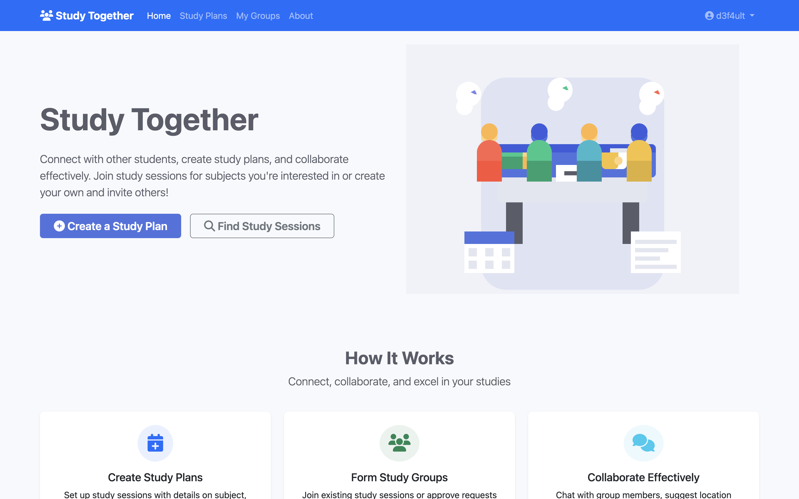
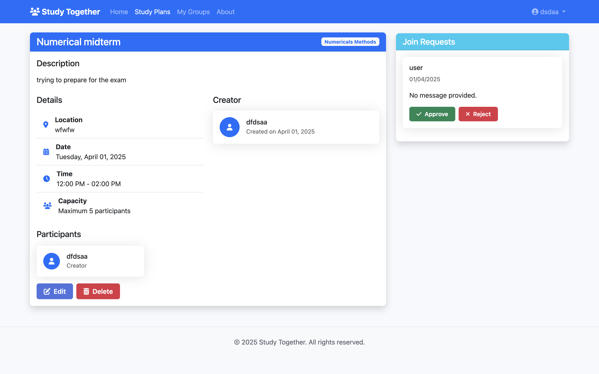

<p align="center">
  
</p>

<div align="center">
  
  <a href="https://github.com/Ph4ntomByte/Study_Together/blob/main/LICENSE">
    
  </a>
  <a href="https://github.com/Ph4ntomByte/Study_Together/issues">
    
  </a>
  
</div>

--- 


A collaborative platform for students to organize and join study sessions.

---

## 🚀 Features

- **📝 Study Plan Creation**: Schedule sessions with location, time, and subject details.
- **🔒 Privacy Controls**: Public listings or share via private invitation links.
- **🤝 Collaboration**: Browse, join, or create study groups.
- **💬 Group Chat**: Real-time chat to coordinate within your group.
- **📍 Meeting Management**: Propose and vote on new meeting locations or times.
- **📊 Progress Tracking**: Mark topics complete and view overall group progress.

---

## 🎨 Screenshot Gallery

Explore the platform's interface:

<div style="display: flex; justify-content: center; gap: 1rem;">
  
   
</div>

---

## 🤝 Get Involved

We welcome feedback and contributions! Whether you're reporting a bug or requesting a feature:

- **Support & Feedback**: Email us at **support@studentlifeishell.me**  
- **GitHub Issues**: [Submit an issue](https://github.com/Ph4ntomByte/Study_Together/issues)  

---

## 📂 Project Structure

```
study_together/
├── app/                   # Flask backend application
│   ├── app.py             # Flask app factory and routes
│   └── main.py            # Entry point for production run
├── instance/              # Instance-specific configurations
├── migrations/            # Flask-Migrate scripts
├── pics/                  # Logo and image assets
├── Dockerfile             # Build instructions for Docker image
├── docker-compose.yml     # Compose file to launch services
├── requirements.txt       # Python dependencies
├── pyproject.toml         # Packaging metadata
├── package.json           # Placeholder for JS deps
├── LICENSE                # MIT License
└── README.md              # This file
```

---
### 🐳 Docker Deployment
 1. In the project root, build and run containers:
   ```bash
   docker compose up -d --build
   ```

### Setup

1. **Clone Repo**  
   ```bash
   git clone https://github.com/Ph4ntomByte/Study_Together.git
   cd Study_Together
   ```
2. **Virtualenv**  
   ```bash
   python3 -m venv venv
   source venv/bin/activate   # Linux/macOS
   ```
3. **Install Requirements**  
   ```bash
   pip install --upgrade pip setuptools wheel
   pip install -r requirements.txt
   ```
4. **DB Migrations**  
   ```bash
   flask db upgrade
   ```
5. **Run Flask**  
   ```bash
   flask run --host=0.0.0.0 --port=5000
   ```
6. **Browse**: `http://localhost:5000`

---

## 📄 License

This project is licensed under the GNU License. See the [LICENSE](LICENSE) file for details.

---

## 📞 Contact

Feel free to reach out at `support@studentlifeishell.me` for any questions or feedback.